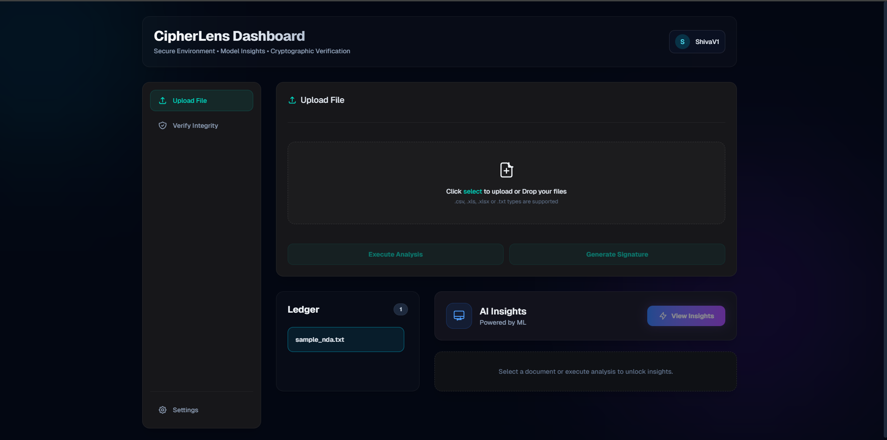
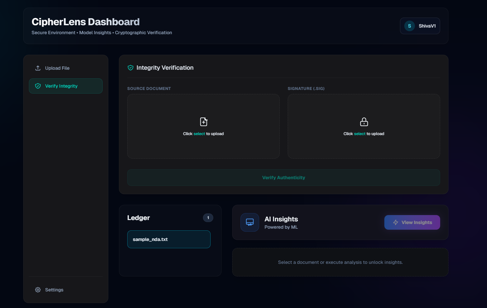

# CipherLens 🛡️🔍

> **AI-Enhanced Cryptographic Document Processing Platform** — Merging zero-trust cybersecurity with cutting-edge Machine Learning to securely sign, verify, and intelligently categorize sensitive documents.

---

## 📸 Dashboard



---

## ✨ Key Features

### 🧠 Intelligent Document Categorization (AI)
- Hybrid NLP classification engine powered by `facebook/bart-large-mnli` (via Hugging Face Inference API) combined with a domain-specific keyword signal layer.
- Auto-classifies documents into categories: **NDA, Invoice, Contract, Medical Record, Legal Document, Financial Report, Job Resume**, and more — upon upload with no user input required.

### 🔐 Cryptographic Integrity & Signing
- Automatically generates **RSA Key Pairs** for each registered user on signup.
- Computes **SHA-256 hashes** of uploaded files and cryptographically signs them using **AES-GCM encrypted private keys** stored at rest.
- Robust **Integrity Verification** engine — upload a source document + `.sig` file to detect any forgery or tampering.

### 📊 AI Telemetry Dashboard
- Real-time ML insight card showing classification confidence, document type, and entity extraction results.
- Document Ledger with persistent audit trail of all signed documents.

### 🖥️ Modern, Responsive UI
- Built with **Next.js 15** and **Tailwind CSS**.
- Glassmorphism design, smooth tab animations, drag-and-drop file uploads, and cinematic login transitions.
- Sidebar-based navigation with Upload & Integrity Verification tabs.

### 🚀 Production-Ready Architecture
- Asynchronous ML inference runs as **FastAPI BackgroundTasks** — signing never blocks on AI processing.
- **JWT-based OAuth2** authentication with encrypted session persistence.
- Modular codebase: `/api`, `/core`, `/ml_models`, `/services`.

---

## 📸 AI Insights & Verification

<div align="center">
  
  &nbsp;
  
</div>

---

## 🛠️ Tech Stack

| Layer | Technology |
|---|---|
| **Backend** | FastAPI, Uvicorn, Python 3.10+ |
| **AI / NLP** | Hugging Face `transformers`, `facebook/bart-large-mnli`, `spaCy en_core_web_sm` |
| **OCR & Extraction** | PyMuPDF, pytesseract, python-docx |
| **Cryptography** | `pycryptodome` (RSA-2048, AES-256-GCM, SHA-256) |
| **Auth** | JWT (python-jose), Passlib (Bcrypt) |
| **Database** | SQLite → PostgreSQL-ready (SQLAlchemy) |
| **Frontend** | Next.js 15, React 19, Tailwind CSS |
| **Storage** | Local filesystem → S3/MinIO-ready |

---

## 🚀 Getting Started

### Prerequisites
- **Python** 3.10+
- **Node.js** v20+
- A **Hugging Face API Token** (free at [huggingface.co](https://huggingface.co)) for cloud-accelerated NLP inference

### 1. Clone the repository
```bash
git clone https://github.com/yourusername/CipherLens.git
cd CipherLens
```

### 2. Configure environment variables
Create a `.env` file in the root directory:
```env
MASTER_KEY=your-32-character-secret-key-here
HF_TOKEN=hf_your_huggingface_token_here
SECRET_KEY=your-jwt-secret-key
```

### 3. Start the full stack
```powershell
# Windows — runs backend & frontend concurrently
.\start_local.ps1
```

Or run individually:

**Backend:**
```bash
python -m venv venv
venv\Scripts\activate
pip install -r backend/requirements.txt
.\venv\Scripts\python.exe -m uvicorn backend.main:app --reload --port 8080
```

**Frontend:**
```bash
cd frontend
npm install
npm run dev
```

| Service | URL |
|---|---|
| **Frontend** | http://localhost:3000 |
| **API Docs (Swagger)** | http://localhost:8080/docs |

---

## 📂 Project Structure

```
CipherLens/
├── backend/
│   ├── api/            # FastAPI routers (auth, documents, ml, security)
│   ├── core/           # RSA key generation & cryptographic signing
│   ├── db/             # SQLAlchemy engine & session factory
│   ├── ml_models/      # Text extractor, NLP classifier, NER extractor
│   ├── models/         # SQLAlchemy ORM models
│   └── services/       # ML pipeline orchestration & storage service
├── frontend/
│   └── app/            # Next.js 15 App Router pages & components
├── assets/             # Screenshots for documentation
└── start_local.ps1     # One-click local dev launcher
```

---

## 🔒 Security Notes

- Private RSA keys are **AES-256-GCM encrypted at rest** — never stored in plaintext.
- All API endpoints are protected by **JWT Bearer token** authentication.
- Documents are stored with hashed filenames to prevent enumeration.
- `MASTER_KEY` and `HF_TOKEN` must be provided via environment variables — never hardcoded.

---

*Built as part of a 12-week public build series exploring the intersection of Data Science & Cybersecurity.*
